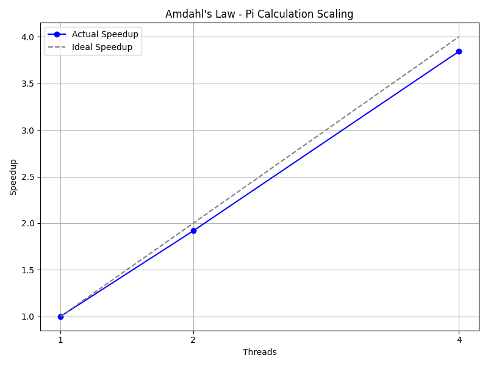

# Lesson 2: Amdahl's Law and Scalability

In this module, we will compute $\pi$ using numerical integration and observe how execution time scales with the number of threads.

## Compilation

First, compile the C++ code with OpenMP support:

```bash
g++ -O3 -fopenmp pi_calc.cpp -o pi_calc
```

## Execution via Slurm Job

Instead of running these commands interactively, we will submit a Slurm batch job. This script will automatically compile the program, run the experiments with varying thread counts, and output the results into a CSV file (`amdahl_results.csv`).

Submit the job using the provided script:

```bash
sbatch run_experiments.sh
```

You can check the status of your job with `squeue` and look at the output in `amdahl_test.out`. Once the job finishes, a file named `amdahl_results.csv` will be generated.

## Visualizing Amdahl's Law

We provide a Python script that reads the generated `amdahl_results.csv` and automatically plots the speedup curve compared to the ideal linear speedup.

Run the script to generate the figure:

```bash
python3 plot_amdahls.py
```



## Reflection

1. Analyze the speedup as you increase the number of threads. Does it scale perfectly linearly?
2. Looking at the `pi_calc.cpp` code, what parts of the execution are serial (cannot be parallelized)? How do thread creation overhead and atomic operations contribute to the non-ideal scaling according to Amdahl's Law?
