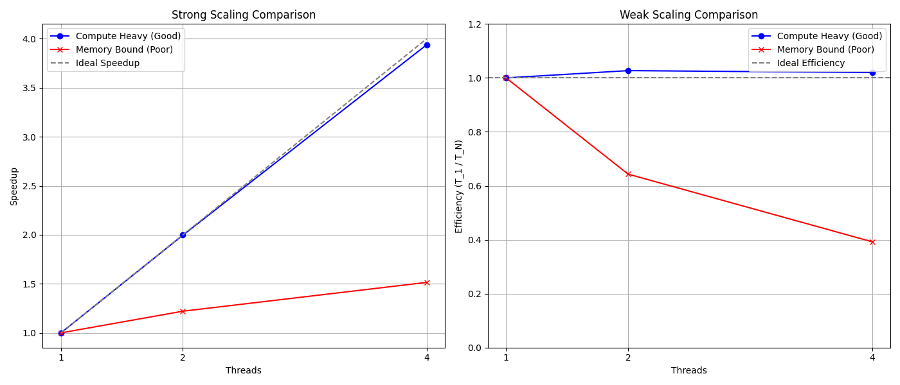

# Lesson 3: Strong and Weak Scaling

In parallel computing, we evaluate the performance of an application using two main scaling models:
1. **Strong Scaling:** The total problem size remains fixed as we add more processors. We want to solve the *same* problem *faster*.
2. **Weak Scaling:** The problem size per processor remains fixed (meaning the total problem size grows linearly with the number of processors). We want to solve a *larger* problem in the *same amount of time*.

In this lesson, we will compare two applications:
- `compute_heavy.c`: An application doing a lot of mathematical operations per memory read.
- `memory_bound.c`: An application doing very little math per memory read (a simple array addition).

We will observe how their scalability behaviors differ drastically due to hardware bottlenecks.

## Compilation

```bash
gcc -O3 -fopenmp compute_heavy.c -o compute_heavy
gcc -O3 -fopenmp memory_bound.c -o memory_bound
```

## Execution via Slurm Job

Instead of running these commands interactively, we will submit a Slurm batch job. This script will automatically compile both programs, run the scaling experiments, and output the results into a CSV file (`scaling_results.csv`).

Submit the job using the provided script:

```bash
sbatch run_experiments.sh
```

You can check the status of your job with `squeue` and look at the output in `scaling_test.out`. Once the job finishes, a file named `scaling_results.csv` will be generated.

## Visualizing Scaling Curves

We provide a Python script that reads the generated `scaling_results.csv` and automatically plots the comparison curves.

Run the script to generate the figure:

```bash
python3 plot_scaling.py
```



## Reflection Questions

1. Look at the code in `memory_bound.c` (Array Addition) vs `compute_heavy.c` (Math Loop). Why does the `memory_bound` application fail to achieve ideal strong scaling? What hardware component is maxed out?
2. In the Weak Scaling scenario, we gave the `memory_bound` application 4x the CPU cores to handle 4x the data. Why did the efficiency drop heavily instead of staying at 1.0? 
3. How does Arithmetic Intensity (the ratio of computation to memory traffic) dictate whether an application will scale well on a modern cluster?
