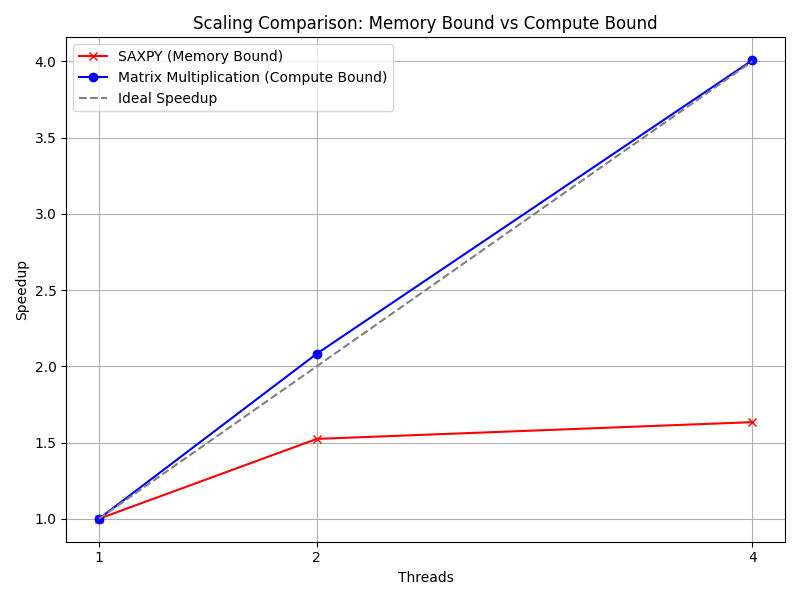
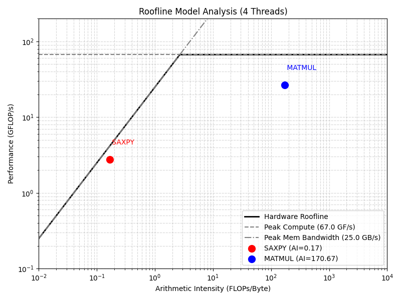

# Lesson 4: Hardware Limits and Roofline Model

The Roofline Model provides a visual representation of performance bounds based on hardware capabilities (peak FLOP/s and peak memory bandwidth). A crucial metric in this model is **Arithmetic Intensity**, defined as:

$$\text{Arithmetic Intensity} = \frac{\text{Total Floating Point Operations (FLOPs)}}{\text{Total Memory Traffic (Bytes)}}$$

## Calculating Arithmetic Intensity

### 1. SAXPY (`Y = aX + Y`)
Look at the `saxpy.c` source code. 
- How many floating-point operations occur per loop iteration?
- How many bytes are read from and written to main memory per iteration? (Assume `float` is 4 bytes).
- **Calculate the theoretical Arithmetic Intensity for SAXPY.**

### 2. Matrix Multiplication (L1 Cache)
Look at the `matmul_l1.c` source code. The matrices are extremely small ($32 \times 32$) and designed to fit entirely within the L1 cache.
- For standard matrix multiplication ($C = A \times B$), there are $2N^3$ FLOPs.
- Because it fits entirely in the L1 cache, main memory traffic is only the initial load of $A$ and $B$, and the final store of $C$ (totaling $3N^2 \times 4$ bytes).
- **Calculate the theoretical Arithmetic Intensity for this L1-bound Matrix Multiplication.**

## Execution via Slurm Job

Instead of running these commands interactively, we will submit a Slurm batch job. This script will automatically compile both programs, run the scaling experiments, and output the results into a CSV file (`roofline_results.csv`).

Submit the job using the provided script:

```bash
sbatch run_experiments.sh
```

You can check the status of your job with `squeue` and look at the output in `roofline_test.out`. Once the job finishes, a file named `roofline_results.csv` will be generated.

## Visualizing Bottlenecks and the Roofline Model

We provide a Python script that reads the generated `roofline_results.csv`. It automatically computes the theoretical Arithmetic Intensity for both algorithms based on their data size and operations, and generates two plots:

1.  **Scaling Curves**: Shows the speedup as threads increase.
2.  **Roofline Model Plot**: Maps the Arithmetic Intensity against the achieved GFLOP/s, illustrating exactly where the algorithms sit relative to the hardware limits of our CPU partition.

Run the script to generate the figures:

```bash
python3 plot_roofline.py
```

### Scaling Comparison


### Roofline Model Analysis


## Concluding Analysis

Based on the generated plots:

1. Look at the `SAXPY` point on the Roofline plot. Which "roof" (ceiling) is preventing it from running faster? How does its low Arithmetic Intensity explain the flatlining in the Scaling Comparison plot?
2. Look at the `MATMUL` point on the Roofline plot. Why is it located so much further to the right on the x-axis? How does this allow it to achieve a near 4.0x speedup on 4 threads?
