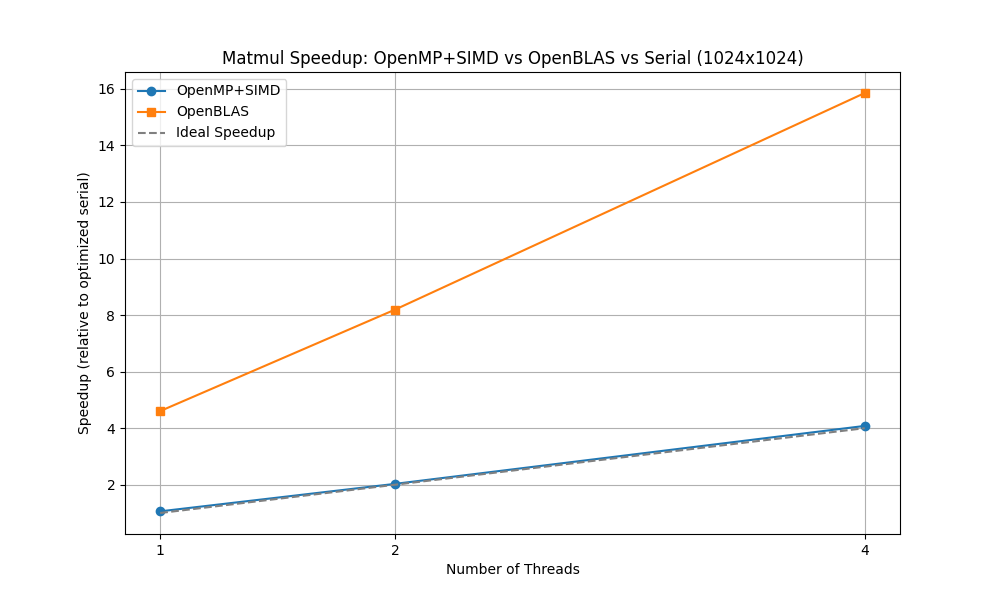
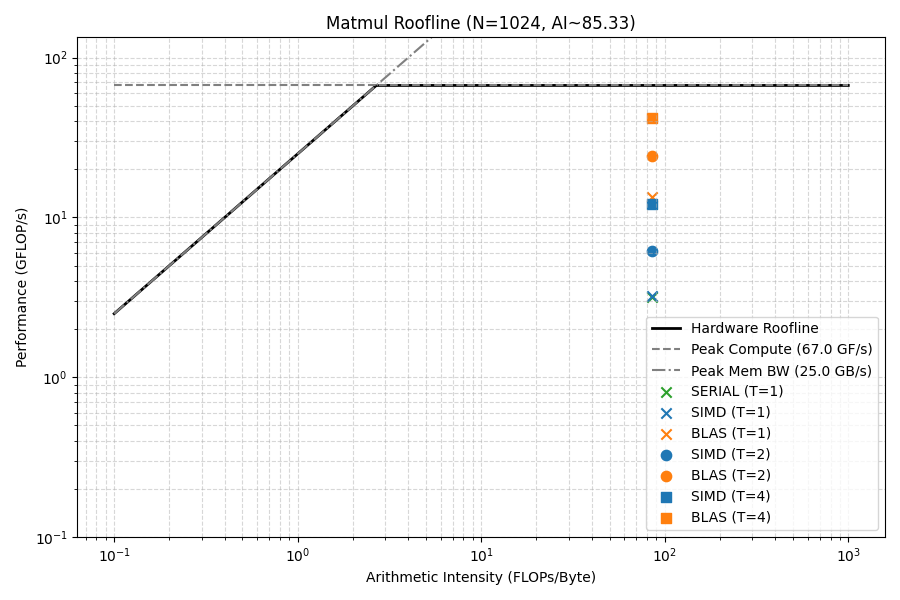

# 6. Matrix Multiplication Optimizations

This lesson compares a highly optimized "pure" OpenMP + SIMD implementation of dense matrix multiplication against a highly tuned BLAS (Basic Linear Algebra Subprograms) implementation, such as OpenBLAS or Intel MKL.

## Learning Objectives
- Understand cache-aware loop ordering (e.g., swapping `i, j, k` to `i, k, j`).
- Leverage `#pragma omp simd` to explicitly direct the compiler to vectorize the inner loop.
- Compare handwritten optimizations to established numerical libraries (BLAS).
- Interpret performance, scalability, and roofline charts for matrix operations.

## Exercises & Examples
- `examples/matmul_omp_simd.c`: A matrix multiplication implementation applying cache blocking, multithreading, and SIMD vectorization.
- `examples/matmul_omp_blas.c`: A matrix multiplication using `cblas_dgemm`.
- `exercises/exercise_matmul_loop_order.c`: Practice loop ordering (compare i-j-k vs i-k-j).
- `solutions/exercise_matmul_loop_order.c`: Reference solution.

## Performance Analysis
The `examples/figures/` directory contains charts comparing these implementations:

### Results on INF0090 Cluster



### Roofline Chart



The benchmark produces `examples/results.csv` on the cluster. To regenerate the roofline plot:

1. Run the benchmark on the cluster (Slurm `cpu` partition):
   ```bash
   cd examples && sbatch benchmark.sh
   ```
2. Copy `results.csv` back to your local machine:
   ```bash
   scp info090:~/02-openmp-basics/6-matmul-optimizations/examples/results.csv examples/
   ```
3. Run the roofline script locally (requires `numpy` + `matplotlib`):
   ```bash
   cd examples && python3 roofline_matmul.py --results results.csv --out figures/matmul_roofline.png
   ```

## Compilation and Execution on the INF0090 Cluster

First, compile your code on the login node. You will need to link the BLAS library for the second example (e.g., `-lopenblas`):
```bash
cd examples
gcc -O3 -march=native matmul_serial.c -o matmul_serial
gcc -fopenmp -O3 -march=native matmul_omp_simd.c -o matmul_simd
gcc -fopenmp -O3 -march=native matmul_omp_blas.c -o matmul_blas -lopenblas
```

### Running directly with `srun`
You can execute the compiled program directly on a compute node using `srun`:
```bash
cd examples
# Set the number of threads you want to use
export OMP_NUM_THREADS=4
export OPENBLAS_NUM_THREADS=4

# Run on the cpu partition
srun --partition=cpu --nodes=1 --ntasks=1 --cpus-per-task=4 ./matmul_simd
srun --partition=cpu --nodes=1 --ntasks=1 --cpus-per-task=4 ./matmul_blas
```

### Running via Batch Script (`sbatch`)
Alternatively, for longer runs, you can submit a batch job. Create a script named `job.slurm` inside `examples/`:

```bash
#!/bin/bash
#SBATCH --partition=cpu
#SBATCH --nodes=1
#SBATCH --ntasks=1
#SBATCH --cpus-per-task=4
#SBATCH --time=00:05:00
#SBATCH --output=slurm-%j.out

# Set the number of threads to the requested CPUs
export OMP_NUM_THREADS=$SLURM_CPUS_PER_TASK
export OPENBLAS_NUM_THREADS=$SLURM_CPUS_PER_TASK

# Run the executable
./matmul_simd
./matmul_blas
```

Submit the job using:
```bash
cd examples && sbatch job.slurm
```
You can view the output in the generated `slurm-<job_id>.out` file.

## Questions
- Why is loop ordering (i, k, j) faster than the standard math definition (i, j, k) for matrix multiplication in C?
- Even with optimal loop ordering and SIMD, why does BLAS (like OpenBLAS/MKL) typically still outperform handwritten code?
