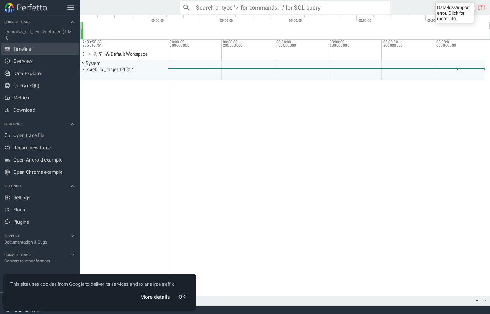

# 4. Profiling HIP Applications with AMD Tools (rocprofv3 / rocminfo)

This lesson shows how to profile a HIP application using **rocprofv3** (and device inspection with **rocminfo**).

In addition to CSV/JSON stats, we also export a **pftrace** timeline compatible with **https://ui.perfetto.dev** so you can visually inspect kernels, dispatches, and memory copies.

---

## Files
- `profiling_target_hip.cpp`: the workload used for profiling.
- `profiling_target_hip.cpp`: workload used for profiling.
- `profile_hip.sh`: builds and runs rocprofv3 and also exports **pftrace** + trace CSVs.

---

## Run the profiling (GPU node)
The scripts must run on the **GPU node** (example: `g1`).

```bash
cd 4-hip-profiling-amd-tools
bash profile_hip.sh
```

This produces outputs under:
- `./rocprofv3_out/`
  - `rocprofv3_out_results.pftrace` ✅ Perfetto timeline
  - `rocprofv3_out_results.json`
  - `rocprofv3_out_*_stats.csv`
  - `rocprofv3_out_*_trace.csv`

---

## Step-by-step: profiling with rocprofv3

### 0) Tool usage
`rocprofv3` usage:
```bash
rocprofv3 [options] -- <application> [application options]
```

---

### 1) Required rule: `--stats` must be combined with tracing
If you want the “stats” outputs, `--stats` must be combined with **one or more tracing options**.

### 2) Collect stats (+ summary)
Example:
```bash
rocprofv3 \
  --stats \
  --kernel-trace --hip-runtime-trace --memory-copy-trace \
  --summary --summary-output-file rocprofv3_summary \
  --output-directory rocprofv3_out \
  --output-file rocprofv3_out \
  -f csv json \
  -- ./profiling_target
```

### 3) Collect trace and export for Perfetto (pftrace)
Example:
```bash
rocprofv3 \
  --stats \
  --kernel-trace --hip-runtime-trace --memory-copy-trace \
  --summary --summary-output-file rocprofv3_summary \
  --output-directory rocprofv3_out \
  --output-file rocprofv3_out \
  -f pftrace json csv \
  -- ./profiling_target
```

The important/verified rocprofv3 flags used in this folder:
- `--stats`
- `--kernel-trace`
- `--hip-runtime-trace`
- `--memory-copy-trace`
- `--summary` **(this is the summarization output)**
- `--summary-output-file <file>`
- `-f pftrace json csv` (note: rocprofv3 expects **space-separated** formats)

---

## Output formats (what you will see)
Inside `rocprofv3_out/` you will typically find:
- `rocprofv3_out_results.pftrace` → timeline for `ui.perfetto.dev`
- `rocprofv3_out_results.json` → detailed results
- `rocprofv3_out_*_stats.csv` → aggregated stats per domain
- `rocprofv3_out_*_trace.csv` → event-level traces (kernel dispatch, memory copies, …)

---

## Perfetto: load pftrace step-by-step

### A) Open Perfetto
Go to: https://ui.perfetto.dev

### B) Import the trace
1. Upload `rocprofv3_out_results.pftrace`.
2. Wait until the timeline appears.

### C) Explore
- Search for kernel name `transform_kernel`.
- You should see multiple dispatch instances (this workload launches the kernel many times).
- With `--memory-copy-trace`, you can also correlate kernel execution with copy events.

---

## Example: screenshot from this AMD profiling run

The following screenshot was generated by opening `rocprofv3_out_results.pftrace` in Perfetto.
It shows the timeline created for the `profiling_target_hip` workload (including repeated `transform_kernel` dispatches).



---

## Quick numeric results (from rocprofv3 summary)

The table below is extracted from the generated `rocprofv3_out_*_stats.csv` / summary.
It summarizes the GPU work dominated by:
- kernel execution (`transform_kernel`)
- memory transfers (host-to-device and device-to-host)

| Component | What | Calls | Total time (ns) | Total time (ms) | Avg (ns) |
|---|---:|---:|---:|---:|---:|
| Kernel | `transform_kernel(...)` | 51 | 243,685 | 0.243685 | 4,778.14 |
| H2D copy | `MEMORY_COPY_HOST_TO_DEVICE` | 1 | 81,561 | 0.081561 | 81,561.00 |
| D2H copy | `MEMORY_COPY_DEVICE_TO_HOST` | 1 | 81,802 | 0.081802 | 81,802.00 |
| Total copies | H2D + D2H | 2 | 163,363 | 0.163363 | 81,681.50 |

---

## Perfetto: saving / sharing the output
For teaching/debugging:
1. Keep `rocprofv3_out_results.pftrace`.
2. Share the entire `rocprofv3_out/rocprofv3_out/` folder with students.

Perfetto-compatible workflow:
- Import `*.pftrace` into `ui.perfetto.dev`.
- Export from Perfetto UI if you want bundles/other formats.

## Exercise question
From the generated output in `rocprofv3_out/rocprofv3_out/`:
- Confirm that `transform_kernel(...)` has 51 calls.
- Use the pftrace in Perfetto to verify how kernel dispatch intervals relate to memory copy events.