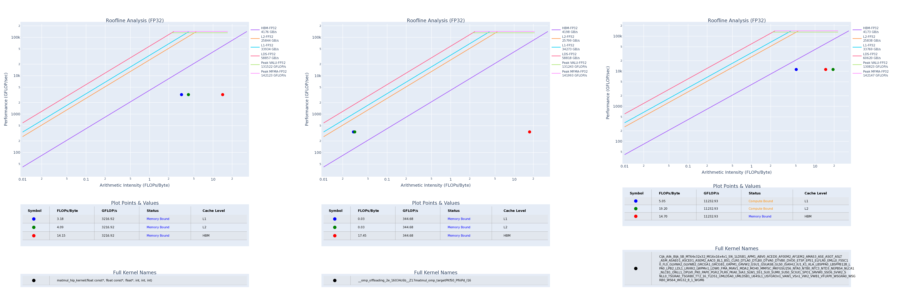

# 6. Matmul roofline: OpenMP target vs HIP vs rocBLAS

This lesson focuses on **roofline profiling** for three GPU implementations:
- **HIP kernel** (explicit GPU kernel)
- **OpenMP target offload** (compiler-driven offload)
- **rocBLAS** (library GEMM)

There is no student implementation task here; we keep only the **solution executables**
needed to generate the roofline plots.

## Learning Objectives
- Compare “explicit GPU kernels” (HIP) with “compiler-driven offload” (OpenMP target).
- Compare both against a vendor library (rocBLAS).
- Measure and interpret timing breakdowns.
- Use `rocprof-compute` roofline plots to reason about operational intensity.

## Code layout (minimal)
- `hip_matmul.cpp`
- `omp_target_matmul.cpp`
- `rocblas_matmul.cpp`
- `run_roofline_matmul_openmp_vs_hip.sh`

## HIP timing breakdown
The HIP executable reports:
- `hip_alloc_transfer_time`: time in `hipMalloc` + `hipMemcpy` (H2D + D2H)
- `hip_kernel_time`: time spent in the HIP kernel only (HIP events)
- `hip_total_time = hip_alloc_transfer_time + hip_kernel_time`

## Key performance improvements made in this lesson
- HIP kernel: **tiled GEMM using shared memory** and **padding** (`TILE x (TILE+1)`) to reduce bank conflicts.
- OpenMP target: uses a **B transpose (`B_T`)** so the device kernel reads B contiguously (better coalescing).

> OpenMP still needs more work than a hand-tuned shared-memory GEMM, but the transpose typically improves bandwidth utilization.

## Compilation on the INF0090 Cluster (GPU node g1)

You can override the matrix dimension at *runtime* by passing a first positional argument `DIM` to each executable.
If you do not pass it, the default is compiled `MAT_DIM`.

### Compile (all three, from the lesson directory `6-matmul-omp-target-vs-hip/`)
```bash
hipcc -O3 -fopenmp --offload-arch=gfx942 -std=c++17 hip_matmul.cpp -o hip_matmul
amdclang++ -O3 -fopenmp -fopenmp-targets=amdgcn-amd-amdhsa -Xopenmp-target -march=gfx942 -std=c++17 omp_target_matmul.cpp -o omp_target_matmul
hipcc -O3 -fopenmp --offload-arch=gfx942 -std=c++17 rocblas_matmul.cpp -lrocblas -o rocblas_matmul
```

### Runtime env (OpenMP runtime on g1)
On the GPU node, ensure the OpenMP runtime is available:
```bash
export LD_LIBRARY_PATH=/opt/rocm/lib/llvm/lib:$LD_LIBRARY_PATH
```

## Run with `srun`

All three commands run from the lesson directory (`6-matmul-omp-target-vs-hip/`):

HIP:
```bash
srun --partition=gpu --nodes=1 --ntasks=1 --cpus-per-task=8 --gres=gpu:1 \
  bash -c 'export LD_LIBRARY_PATH=/opt/rocm/lib/llvm/lib:$LD_LIBRARY_PATH; \
            export OMP_NUM_THREADS=${SLURM_CPUS_PER_TASK:-8}; ./hip_matmul 384'
```

OpenMP target:
```bash
srun --partition=gpu --nodes=1 --ntasks=1 --cpus-per-task=8 --gres=gpu:1 \
  bash -c 'export LD_LIBRARY_PATH=/opt/rocm/lib/llvm/lib:$LD_LIBRARY_PATH; \
            export OMP_NUM_THREADS=${SLURM_CPUS_PER_TASK:-8}; ./omp_target_matmul 384'
```

rocBLAS:
```bash
srun --partition=gpu --nodes=1 --ntasks=1 --cpus-per-task=8 --gres=gpu:1 \
  bash -c 'export LD_LIBRARY_PATH=/opt/rocm/lib/llvm/lib:$LD_LIBRARY_PATH; \
            export OMP_NUM_THREADS=${SLURM_CPUS_PER_TASK:-8}; ./rocblas_matmul 384'
```

## Notes
- The executables print a `checksum` to confirm outputs are non-trivial.
- For roofline, the **performance counters** are the focus, not CPU validation.

## Roofline (rocprof-compute) for HIP vs OpenMP target vs rocBLAS

### Script
`run_roofline_matmul_openmp_vs_hip.sh` runs `rocprof-compute --roof-only` for:
- `./hip_matmul`
- `./omp_target_matmul`
- `./rocblas_matmul`

It generates roofline PDFs under:
- `roofline_<run>/hip/`
- `roofline_<run>/omp_target/`
- `roofline_<run>/rocblas/`

If `convert` is available, it also creates a combined PNG.

### Step-by-step to generate a roofline run
1) Install rocprof-compute dependencies on the login node:
```bash
pip3 install --user -r /opt/rocm/libexec/rocprofiler-compute/requirements.txt
pip3 install --user pytz==2021.1
```

2) From the lesson directory (`6-matmul-omp-target-vs-hip/`), run the profiling script.
   It auto-submits to the GPU partition via `srun` — no SSH needed:
```bash
DIM_ARG=384 ./run_roofline_matmul_openmp_vs_hip.sh roofline_run_384
```

4) PDFs are generated on the node. Copy them to your machine and convert to PNG if needed (the lesson repo already includes the final combined PNG for the chosen run).

### Generated roofline image (DIM=384)

**Order in the combined plot:** HIP (left) | OpenMP target (middle) | rocBLAS (right)



### Analysis (what we observe)
From the empirical roofline PDFs:
- **HIP**: the empirical points move significantly closer to the **compute (MFMA) roofs** compared to the naive version.
  This matches the expectation from **tiled shared-memory GEMM** + **coalesced shared loads** + **bank-conflict padding**.
- **OpenMP target**: results improve mainly due to **better bandwidth utilization** from using **B transpose (`B_T`)**.
  However, it still tends to sit below HIP in the highest compute regimes, which is consistent with less effective on-chip data reuse than a hand-tuned shared-memory GEMM.
- **rocBLAS**: usually provides the best overall behavior, with empirical points closest to the strongest compute ceilings.

Overall conclusion:
- Increasing `DIM` increases the operational intensity enough for dense GEMM-like work to become more compute-dominant.
- The remaining gap between OpenMP target and HIP/rocBLAS is largely explained by **device-side tiling/reuse** differences (and to a lesser extent by transfer/launch overhead).

## Question
- For your run, which implementation is closest to the compute ceiling:
  - HIP, OpenMP target, or rocBLAS?
  - Does increasing `DIM_ARG` move all three traces in the same direction on the intensity axis?
